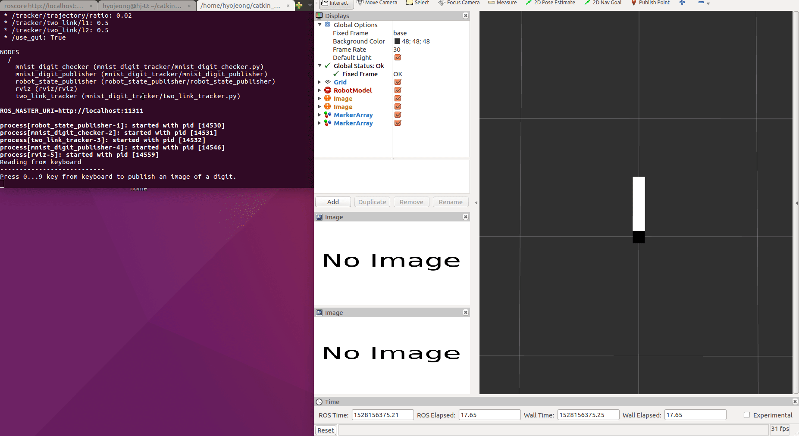
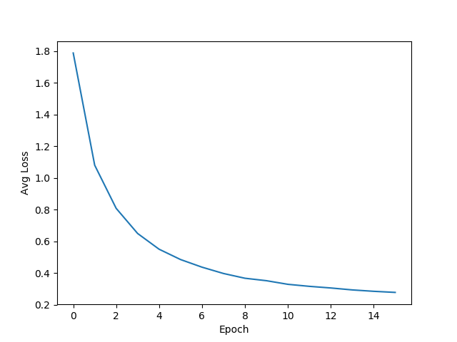
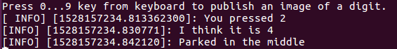
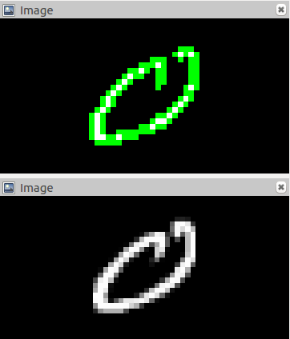
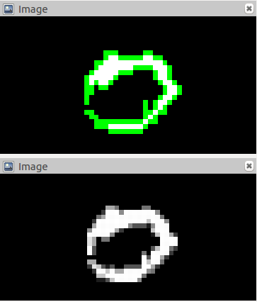
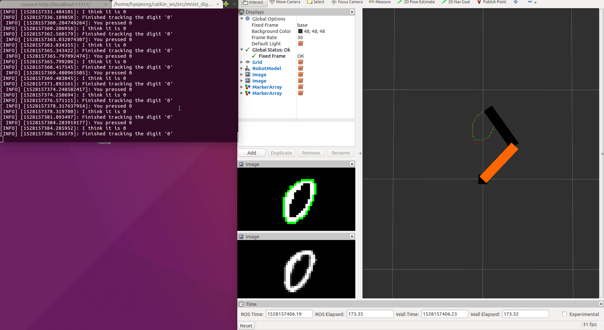

# resl_assignment
## Overview
Node 1: MNIST publisher (C++)
- the node is suppose to read a key 0 .. 9 from keyboard and publish corresponding image of a digit from MNIST dataset.
- everytime the user presses a digit it should randomize digit from the corresponding digit class.
For example: if it is currently publishing 8 if you press 8 again it should select 8 with different writing.
- make sure that parameters are configurable in a yaml file (such as image topic, maybe other parameters if you need them)
- you can use rviz for digit image visualization
************************************
Node 2: digit tracker with a 2-link manipulator (python 3.5)
- the node subscribes to the MNIST image topic published by the MNIST publisher
- it runs an NN classifier using a pretrained TF model to classify 0 vs the rest of the digits
- if the digit 0 - extract contour corresponding to the digit writing and make a 2-link manipulator track this contour
- if the digit is not 0 - 'park' manipulator in the middle
- manipulator can be simulated with the first order dynamics (i.e. a low pass filter on joint transitions), s.t. you would only have to solve inverse kinematics
- TF model should be completely read from a file, i.e. graph should not be reconstructed, but just read from pre-trained META file (but make sure you show me the training routine as well that should be a separate module from the node)
- TF model path, the topic for subscription, names of model outputs (tensors) that are used for classification should be configurable using yaml file (also add other parameters that you are using there, for example scale of the digit path, speed of tracking, constant of the manipulator dynamics, etc.)
- in rviz visualize the trajectory, the marker of the currently tracked position on the trajectory, tranformations of the manipulator. 
- Ideally you might want to also show the manipulator itself, i.e. create a URDF file with the manipulator robot, but if it is too much, at least make sure you publish all transforms and move manipulator parameters in the config yaml file (instead of URDF)
************************************
Overall:
- make sure you write a HIGH QUALITY CODE and you document it well
- consider performance! (you can write some thoughts about possible bottlenecks and problems)
- create readme and put proper comments everywhere
- use standard code annotations for automatically generated documentation. You can check TF sources on how it is done for python
- try to generate documentation from annotations of your code if you can

## Usage
Run the following command
```
roslaunch mnist_digit_tracker digit_tracker
```


You can change parameters in `mnist_digit_tracker.yaml`.
```xml
publisher:
  topic: /digit/image
  queue_size: 1

tracker:
  image:
    threshold: 100
  two_link:
    l1: 0.5
    l2: 0.5
  trajectory:
    ratio: 0.02
    offset: 0.6
  control:
    Kp: 70
    dt: 0.01
  marker:
    rate: 20
```
publisher is parameters of `mnist_digit_publisher.cpp` and tracker is parameters of `mnist_digit_checker.py` and `two_link_tracker.py`.

## Learning
Used Two layer net for learning MNIST dataset. You can train Neural Net by running `train_nn.py`.
TF trained data is stored in `train_mnist/network`. Weight values of trained data is stored in `train_mnist/weight`.

Avg Loss/Epoch is looks like:



Accuracy is about **92%**.

## Robotics
### Forward Kinematics


### Inverse Kinematics


### Jacobian Inverse

```python
x = self.forward_kinematics(q)	
x_dot = self.Kp*(xd-x)
q_dot = np.dot(self.jacobian_inverse(q), x_dot)
q = q + q_dot*self.dt
```
## Problems

### Wrong Prediction

Since accuracy of trained neural net is 92%, sometimes it predicts wrong answer.



Accuracy can be imporeved by changing two layer net to multylayer convolutional neural net.


### Contour

Because of the threshold value, there is some disconnection in thresholded image of '0'.



It can be imporved by lowering threshold value. But sometimes lowering threshold value is not enough in case like:



If the image of '0' itself is disconnected, countour cannot be round shaped.


### Getting Slower

After multiple tries of pressing the digit, there is some delay in displaying.


